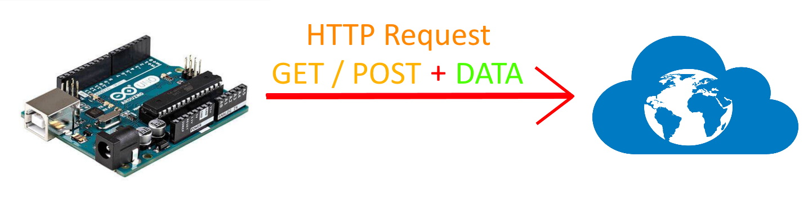
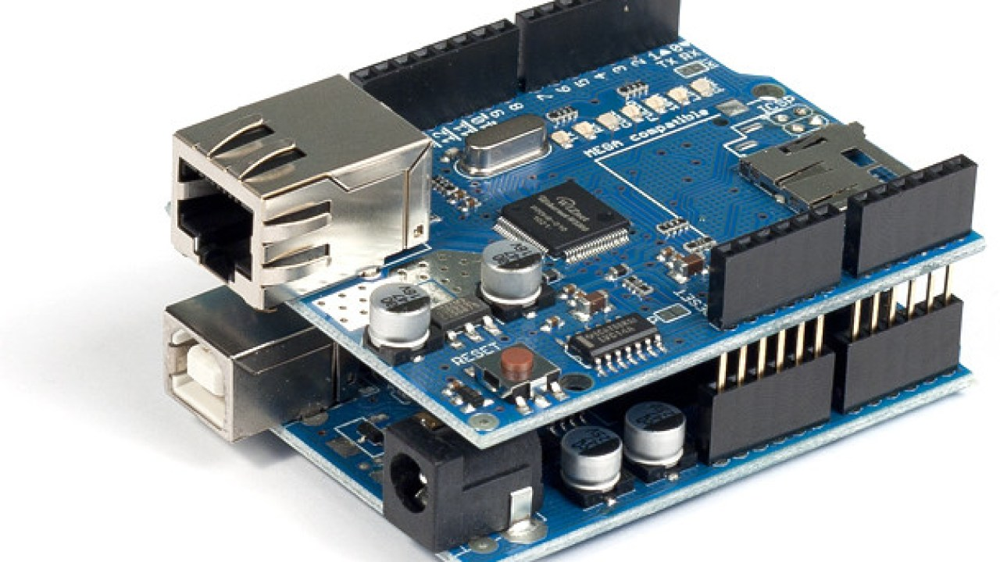

# A project to request Http websites using GET/POST methods using the ARDUINO Development card

## Project Goals

  * Introduction to IOT(Internet of Things) projects using the capabilities of the Arduino Development Board.
  * Inferences about how data is exchanged using various methods on the Internet.

## They Will Be Used In The Project

  * Arduino UNO / Arduino MEGA
  * Arduino Ethernet Shield - Wiznet W5100 / ENC28J60 Ethernet LAN module
  * Ethernet Cable
  * Jumper cables according to requirement

## What Needs To Be Done

  * Connecting our Ethernet module with our Arduino card.
  
  Note! Arduino is shown for UNO.
  
  * [Arduino Code](https://github.com/idrisibrahimerten/arduino_projects/tree/main/2%20-%20ıot_arduino_ethernet_shield_request_projects/arduino_ethernet_shield_http_request_project) & # 8594; go to the Arduino code and open your computer with the ARDUINO IDE. <br>
  * Go to the section where the following codes are located.
```int http_port = 80;
   String http_method = "GET"; / / enter which method to request.
   char host_name[] = "***********"; // the web site be requested to enter.
   String path_name = "/*******"; // if any, enter its path to the page you need to go to on the website.
```
  * I have specified what needs to be done with descriptions in the codes, you can edit it specifically for yourself.

#### Fun Work.

### To Turkish

# ARDUİNO Geliştirme Kartı İle GET/POST Metodlarını Kullanarak Http İnternet Sitelerine İstekte Bulunma Projesi

## Proje Hedefleri

  * Arduino geliştirme kartının yeteneklerini kullanarak IOT(Nesnelerin İnterneti) projelerine giriş yapmak.
  * İnternet üzerine çeşitli metodlar kullanılarak nasıl veri alış-verişi yapılıyor çıkarımlarda bulunmak.

## Projede Kullanılacaklar

  * Arduino UNO / Arduino MEGA
  * Arduino Ethernet Shield - Wiznet W5100 / ENC28J60 Ethernet LAN Modülü
  * Ethernet Kablosu
  * İhtiyaca göre jumper kablolar

## Yapılması Gerekenler

  * Arduino kartımız ile ethernet modülümüzün bağlantısının yapılması.
  
  Not! Arduino UNO için gösterilmiştir.
  
  * [Arduino Kodu](https://github.com/idrisibrahimerten/arduino_projects/tree/main/2%20-%20IOT_arduino_ethernet_shield_request_projects/arduino_ethernet_shield_http_request_project) &#8594; Arduino koduna gidiniz ve bilgisayarınız da ARDUINO IDE ile açınız. <br>
  * Aşağıdaki kodların bulunduğu kısıma gidiniz.
```int    http_port   = 80;
   String http_method = "GET"; // hangi metodda istekte bulunacağınızı giriniz.
   char   host_name[] = "***********"; // istekte bulunulacak web sitesini giriniz.
   String path_name   = "/*******"; // varsa web sitesinde gitmeniz gereken sayfa onun yolunu giriniz.
```
  * Kodların içinde açıklamalar ile yapılması gerekenleri belirttim kendinize özel olarak düzenleyebilirsiniz.

#### Keyifli Çalışmalar.
